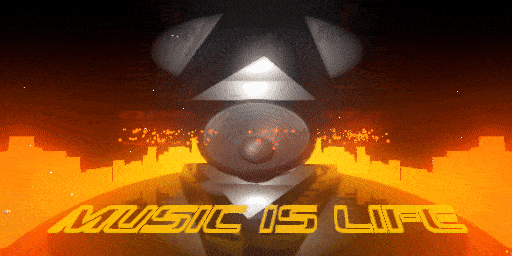

Microlizer
==========
Microlizer is a GDScript audio visualiser written for the Godot game engine. It was born out of an interest in driving a 3D scene from audio input and could be useful for live visuals.

Features
--------
- Frequency driven (snare/punch) 3D custom built speaker object.
- Multi-frequency 3D VU meters.
- Volume driven custom 3D "Music is Life" object.
- Continuous counter-rotating triangle objects.
- Pulsating scene lights.
- Warp-style particle field.
- Galaxy-style particle disc field.
- Low frequency driven camera shake.
- Continuously moving camera path.
- Custom low frequency driven chromatic aberration shader. 
- Multiple colour gradient presets including white.
- Glow, reflection and anti-aliasing effects.
- Key commands including key overview.
- 2D VU meter debug overview featuring all internal frequencies and volumes.

How to Use
----------
You can run the code directly in debug mode or build for specific architecture in the Godot game engine.
It was built in Godot v3.4.4.stable.flathub [419e713a2] but should be fine in an up-to-date v3.
It has not yet been tested in Godot v4.
Godot is easy to install and can be downloaded at <https://godotengine.org/>

**Keyboard Controls**

- 0: White colour preset change
- 1-7: Multi-colour preset changes
- K: Toggle keyboard controls
- G: Galaxy visibility toggle
- F: Fullscreen toggle
- D: Debug visibility toggle
- Q: Quit application

Issues
------
- Microlizer should use the current default audio in of the machine (eg. a microphone). This may mean you will require some monitor source routing in order to, for example, have main computer speaker output also be the input for Microlizer.
- There will always be some latency between the audio source sound, and the render in Microlizer. I've found delaying the audio before it's leaving your machine for its intended purpose, eg. in OBS Studio if streaming, is a decent workaround. For me best results streaming via OBS was a delay of about 250ms.
- There is some artifacting from screen space reflections. This might be something to fix in Godot 4.

Credits
-------
Written by MicroMaxima - <https://twitter.com/Micromaxima>  
Thanks to Gonkee for his AV vid - <https://www.youtube.com/watch?v=AwgSICbGxJM>

License
-------
Released under the MIT License